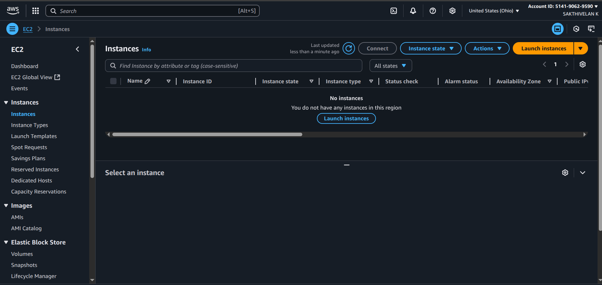

# AWS EC2 Vocabulary - Day 01

## Core Concepts

| Term | Definition | Example |
|------|------------|---------|
| EC2 (Elastic Compute Cloud) | Virtual servers in AWS cloud | Instead of buying a laptop/server, you rent a virtual machine on AWS |
| Instance | A virtual server in the cloud | You launch one instance that runs Ubuntu + Nginx to host your web app |
| AMI (Amazon Machine Image) | Pre-configured templates for instances | You pick "Ubuntu 22.04 LTS AMI" to quickly start your instance |
| Instance Type | Hardware configuration of the virtual server | t2.micro (1 vCPU, 1 GB RAM) - Free Tier eligible |
| Instance Family | Categories of instance types based on use case | General Purpose (t2, t3) for web apps, Compute Optimized (c5) for data processing |
| Instance State | Current running status of instance | Running, Stopped, Terminated |
| Elastic IP (EIP) | Static IPv4 address for dynamic cloud computing | A fixed IP address that you can attach to your instance |
| Public/Private IP | Network addressing for instances | Public IP: External access Private IP: Internal AWS network communication |
| User Data | Bootstrap scripts run at instance launch | Scripts to automatically install software like Nginx during instance startup |

*Figure 1: AWS EC2 Dashboard*

## Instance Types and Families

1. **General Purpose (t2, t3)**
   - Balanced compute, memory, and networking
   - Best for web servers and development environments

*Figure 2: Available Instance Types*

2. **Compute Optimized (c5)**
   - High performance processors
   - Ideal for batch processing and heavy computation tasks

*Figure 3: Compute Optimized Instances*

## Launch Instance Process
1. Choose AMI
2. Select Instance Type
3. Configure Instance Details
4. Add Storage
5. Add Tags
6. Configure Security Group
7. Review and Launch

*Figure 4: EC2 Launch Instance Wizard*

## Note
- Remember to stop instances when not in use to save costs
- Free tier includes 750 hours/month of t2.micro instance usage

*Figure 5: EC2 Pricing Overview*